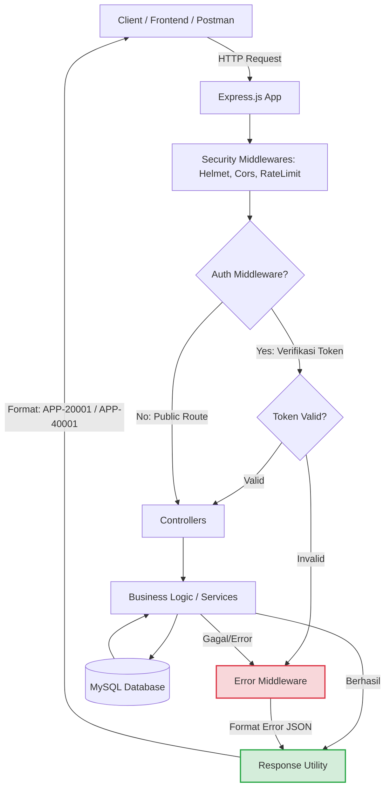
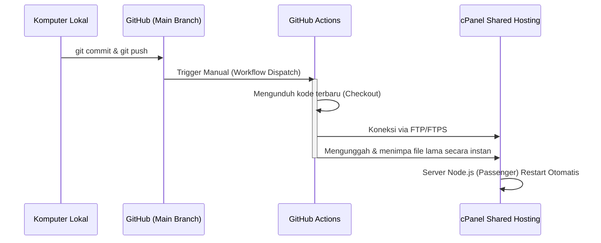
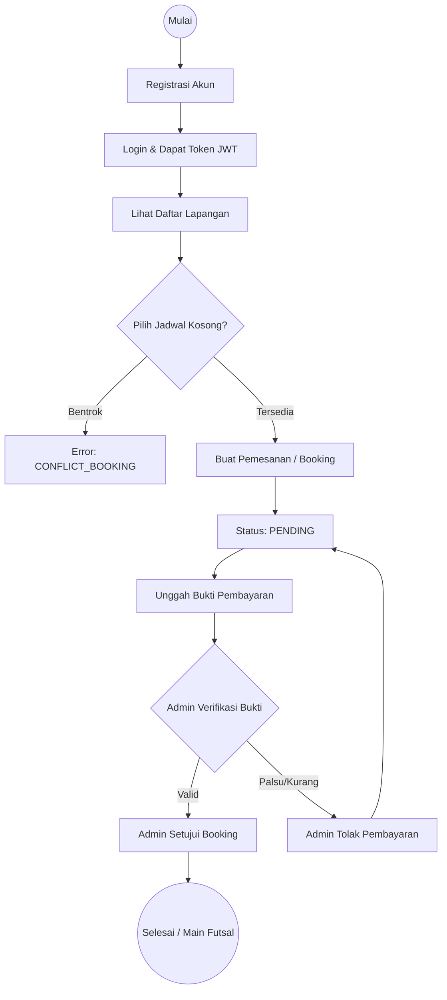

# Futsal Field Reservation API

REST API Backend untuk Sistem Reservasi Lapangan Futsal, dibangun menggunakan Node.js, Express, MySQL 8, dan Sequelize ORM.

## Daftar API Endpoints

### 🔐 1. Auth (Otentikasi)
*Semua endpoint auth bersifat **Public**.*
- `POST /api/auth/register` : Mendaftarkan akun baru.
- `POST /api/auth/login` : Login untuk mendapatkan token JWT.
- `GET /api/auth/profile` : Melihat profil user yang sedang login (Butuh Token).

### 👥 2. Users
*Hanya dapat diakses oleh **ADMIN**.*
- `GET /api/users` : Melihat daftar semua user.
- `GET /api/users/:id` : Melihat detail spesifik seorang user.

### ⚽ 3. Fields (Lapangan)
*Akses campuran antara **Public** dan **ADMIN**.*
- `GET /api/fields` : Melihat semua lapangan yang tersedia (Public).
- `GET /api/fields/:id` : Melihat detail 1 lapangan (Public).
- `POST /api/fields` : Menambahkan lapangan baru (Admin).
- `PUT /api/fields/:id` : Mengedit data lapangan (Admin).
- `DELETE /api/fields/:id` : Menghapus lapangan (Admin).

### 📅 4. Bookings (Pemesanan)
*Dibatasi berdasarkan kepemilikan dan Role.*
- `POST /api/bookings` : Membuat pemesanan baru (Customer).
- `GET /api/bookings/my` : Melihat history pemesanan milik sendiri (Customer).
- `GET /api/bookings/:id` : Melihat detail sebuah pemesanan (Customer pemilik & Admin).
- `GET /api/bookings` : Melihat semua pemesanan dari seluruh user (Admin).
- `PATCH /api/bookings/:id/approve` : Menyetujui pemesanan (Admin).
- `PATCH /api/bookings/:id/reject` : Menolak pemesanan (Admin).

### 💳 5. Payments (Pembayaran)
*Akses campuran.*
- `POST /api/payments` : Mengunggah bukti pembayaran untuk suatu booking (Customer).
- `GET /api/payments` : Melihat semua pembayaran (Admin).
- `PATCH /api/payments/:id/verify` : Memverifikasi bukti pembayaran (Admin).
- `PATCH /api/payments/:id/reject` : Menolak bukti pembayaran (Admin).

---

## Deployment Guide (cPanel Shared Hosting + CI/CD)

Aplikasi ini telah dikonfigurasi untuk menggunakan **Continuous Deployment (CI/CD)** via GitHub Actions langsung ke Shared Hosting (cPanel).

### 1. Setup cPanel Node.js App
1. Buat folder untuk aplikasi di `public_html/api.namadomain.com`
2. Buka menu **Setup Node.js App** di cPanel
3. Buat aplikasi baru:
   - Node.js version: `18/20/24`
   - Application mode: `Production`
   - Application root: `public_html/api.namadomain.com`
   - Application URL: `api.namadomain.com`
   - Startup file: `server.js`
4. Buat file `.env` di dalam folder root aplikasi Anda dengan variabel:
```env
NODE_ENV=production
PORT=3000
DB_HOST=127.0.0.1
DB_PORT=3306
DB_USER=...
DB_PASSWORD=...
DB_NAME=...
JWT_SECRET=rahasia123
```

### 2. GitHub Actions Secrets
Tambahkan kredensial FTP cPanel Anda ke menu **Settings > Secrets and variables > Actions** di repositori GitHub Anda:
- `FTP_SERVER` : (misal: `ftp.namadomain.com`)
- `FTP_USERNAME` : Username FTP cPanel Anda
- `FTP_PASSWORD` : Password FTP cPanel Anda

### 3. Deploy
1. Masuk ke tab **Actions** di GitHub
2. Pilih workflow **Deploy to cPanel (Shared Hosting)**
3. Klik **Run workflow**
4. Setelah selesai, masuk kembali ke cPanel Node.js App, klik **Run NPM Install**, lalu klik **Restart**.

API Anda sekarang berjalan secara *production-ready* dan dapat diakses publik!

---

## Arsitektur & Alur Sistem (Flowcharts)

Berikut adalah beberapa diagram alur (*flowchart*) yang menjelaskan bagaimana sistem Futsal API bekerja:

### 1. Alur Request & Standarisasi Response (API Flow)


### 2. Alur CI/CD Deployment (GitHub ke Shared Hosting)


### 3. Alur Bisnis Reservasi Futsal (Booking)

